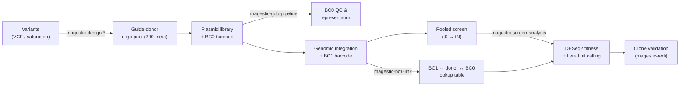

<p align="center">
  
  
  <br>
  <em><b>M</b>ultiplexed <b>A</b>ccurate <b>G</b>enome <b>E</b>diting with <b>S</b>hort, <b>T</b>rackable, <b>I</b>ntegrated <b>C</b>ellular barcodes</em>
</p>

<p align="center">
  <a href="https://magestic.readthedocs.io"></a>
  <a href="https://github.com/k-roy/MAGESTIC/actions"></a>
  <a href="https://opensource.org/licenses/MIT"></a>
  <a href="https://www.python.org/downloads/"></a>
  
</p>

**MAGESTIC** turns a list of genetic variants into a pooled, barcode-tracked CRISPR editing experiment and the analysis that reads it back out. Each variant is built as a **guide + donor** oligo: the guide directs Cas9/Cas12a to cut the target locus, and the homology-arm donor templates the precise edit. Every guide-donor is physically linked to a short DNA **barcode** — first **BC0** in the plasmid library, then a genomically integrated **BC1** — so that after editing you can count cheap barcode reads instead of re-sequencing every edit, and still know exactly which variant each cell in a pool carries.

MAGESTIC 3.0 is one Python package (`magestic`) that covers the full arc: **design** the oligo library, **QC** the plasmid library, **link** screen barcodes back to edits, **quantify** variant fitness from a pooled screen, and **validate** individual clones — plus in-silico variant-effect prediction and locus visualization.



---

## Why barcodes?

A pooled CRISPR screen needs to answer, for thousands of cells at once, *"which edit does this cell carry, and how did its abundance change?"* Re-sequencing the edited locus in every cell is expensive and biased. MAGESTIC instead links each guide-donor to a random barcode at two stages:

| Barcode | Where | Length (default) | Read out by |
|---|---|---|---|
| **BC0** | plasmid library | 10 bp | `magestic-gdb-pipeline` — confirms which guide-donor each plasmid carries and how evenly the library is represented |
| **BC1** | integrated in the genome | 20 bp | `magestic-bc1-link` — builds the BC1 ↔ donor ↔ BC0 map so a BC1 readout names the edit; `magestic-screen-analysis` — counts BC1s across timepoints |

A short BC1 amplicon is all you sequence during the screen; the linkage table converts those counts into per-variant fitness.

---

## The package

| Module | What it does |
|---|---|
| `magestic.design` | Guide-donor oligo design — VCF natural variants & saturation mutagenesis; PAM search, off-target-aware guide selection, donor assembly |
| `magestic.pipelines.guide_donor_bc0` | Plasmid library **BC0 QC**: map reads to designed oligos, BC0 purity, library representation |
| `magestic.pipelines.bc1_donor_bc0` | **BC1-donor-BC0 linking**: parse triplets, link BC1 to guide-donor identity via shared BC0, integrate multiple runs |
| `magestic.pipelines.bc1_from_screen` | **Pooled screen analysis**: BC1 counting, error correction, tier classification, DESeq2, tier-aware hit calling, multi-timepoint fitness |
| `magestic.pipelines.redi` | **REDI** clone-array verification: colony purity, cross-array agreement, WGS edit correspondence |
| `magestic.projects.vep` | **Variant Effect Prediction** — Evo2 (DNA LM), ESM1v (protein LM), Shorkie & Yorzoi (RNA expression) |
| `magestic.projects.nrd1` | NRD1 alanine-scan project with bundled reference data |
| `magestic.plotting` | Locus visualization — gene tracks + VEP score panels |
| `magestic.genomics`, `magestic.utils` | Core genomics (sequence, FASTA, GFF) and cross-pipeline utilities |

---

## Supported nucleases

| Nuclease | PAM | Notes |
|---|---|---|
| **SpCas9** | `NGG` | canonical (Jinek et al. 2012) |
| **SpG** | `NGN` (`NGNN` motif) | relaxed PAM, broader targeting |
| **LbCas12a** | `TTTV` | upstream PAM, staggered cut |
| **impLbCas12a** | expanded PAM set | engineered, broader targeting |

---

## Installation

```bash
# core (design + genomics + utils)
pip install magestic

# add the pieces you need
pip install "magestic[align]"      # rapidfuzz, Levenshtein, pysam — guide_donor_bc0 / bc1_donor_bc0
pip install "magestic[screen]"     # pydeseq2, joblib, openpyxl — bc1_from_screen
pip install "magestic[redi]"       # openpyxl, pyarrow — REDI
pip install "magestic[snakemake]"  # Snakemake workflow management
pip install "magestic[full]"       # everything above
```

Requires **Python ≥ 3.10**. The `[ihw]` extra (Independent Hypothesis Weighting) additionally needs R + `rpy2`; without it the screen pipeline degrades gracefully to Benjamini–Hochberg.

> MAGESTIC is in beta; the CLI and output schemas may change before a tagged 3.x release.

---

## Quick start

### Design a library

```bash
# 1. Enumerate PAM sites + off-target profile for your genome/nuclease (run once)
magestic-pam-search --genome genome.fa --nuclease SpG --output offtargets.tsv

# 2. Design guide-donor oligos for natural variants from a VCF
magestic-design-vcf  --genome genome.fa --gff genes.gff --vcf variants.vcf \
    --nuclease SpG --off-target-file offtargets.tsv --output-prefix my_library

# …or saturate every amino acid position in a target ORF
magestic-design-saturation --genome genome.fa --gff genes.gff --gene NRD1 \
    --nuclease SpCas9 --output-prefix nrd1_saturation
```

### Analyze a screen

```bash
# Plasmid library BC0 QC
magestic-gdb-pipeline    --config gdb_config.yaml

# Link BC1 barcodes to guide-donor identities
magestic-bc1-link        --config bc1_link_config.yaml

# Quantify variant fitness from the pooled screen (DESeq2 + tiered hit calling)
magestic-screen-analysis --config screen_config.yaml
```

Each pipeline is configuration-driven (YAML) and ships a Snakemake workflow for HPC. See the [Quick Start](https://magestic.readthedocs.io) guides for end-to-end walkthroughs with example configs.

---

## Commands

| Command | Description |
|---|---|
| `magestic-pam-search` | Genome-wide PAM enumeration + 0/1-mismatch off-target analysis |
| `magestic-design-vcf` | Guide-donor oligos for natural variants from a VCF |
| `magestic-design-saturation` | Saturation-mutagenesis oligos for a target ORF |
| `magestic-gdb-pipeline` | Plasmid library BC0 QC + representation |
| `magestic-bc1-link` | Link BC1 ↔ donor ↔ BC0 across runs |
| `magestic-screen-analysis` | Pooled-screen DESeq2 + tier-aware hit calling |
| `magestic-redi` | REDI clone-array verification (purity, cross-array, WGS) |
| `magestic-harmonize-oligos` | Merge per-nuclease oligo designs into one annotated table |
| `magestic-annotate-deseq2` | Re-annotate DESeq2 results with the harmonized oligo table |

`magestic-redi-*` per-step entry points (`trim`, `combine-keys`, `extract-bc`, `purity`, `annotate`, `cross-array`, `wgs-check`, `rearray`) are also available for running individual REDI stages.

---

## Documentation

Full documentation at **[magestic.readthedocs.io](https://magestic.readthedocs.io)**:

- **Architecture** — [docs/ARCHITECTURE.md](docs/ARCHITECTURE.md): how the modules fit together, the barcode model, data flow
- **Pipelines** — conceptual deep-dives for each analysis pipeline
- **Algorithms** — PAM search, guide selection, donor assembly, barcode collapse, donor↔oligo matching, tiered hit calling
- **API Reference** — auto-generated from docstrings
- **Known issues** — [docs/overlapping_gene_coordinate_bug.md](docs/overlapping_gene_coordinate_bug.md)

---

## Citation

If you use MAGESTIC, please cite:

> Roy KR, Smith JD, Vonesch SC, *et al.* Multiplexed precision genome editing with trackable genomic barcodes in yeast. *Nature Biotechnology* 36, 512–520 (2018). [doi:10.1038/nbt.4137](https://doi.org/10.1038/nbt.4137)

---

## License

MIT — see [LICENSE](LICENSE).

## Contact

Kevin R. Roy — [kevinrjroy@gmail.com](mailto:kevinrjroy@gmail.com) · GitHub: [k-roy/MAGESTIC](https://github.com/k-roy/MAGESTIC)
