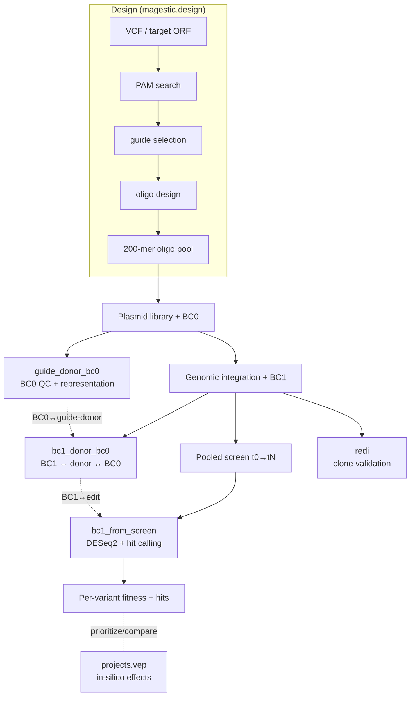

# Architecture

## What this document is

A narrative guide for developers, collaborators, and automated agents to the
design of the `magestic` package — how the modules fit together, the
experimental model they encode, and how data flows from a variant list to a
per-variant fitness call. It answers *"how do the pieces fit?"*; the
[API Reference](api/index.md) (auto-generated from docstrings) answers *"what
does this function do?"*.

---

## The experimental model

MAGESTIC is a system for **measuring the phenotypic effect of many precise edits
at once**. The unifying idea is that every edit is permanently tagged with a
short, sequenceable barcode, so a pooled population of edited cells can be read
out by counting barcodes rather than re-sequencing each edit.

A MAGESTIC experiment proceeds in stages, and each stage maps to a part of the
package:

1. **Design** — for each target variant, choose a guide (where to cut) and build
   a donor (what to write), and pack both into a single synthesizable oligo.
   → `magestic.design`
2. **Plasmid library + BC0** — the oligo pool is cloned into plasmids; each
   plasmid molecule picks up a random **BC0** barcode. Sequencing the library
   establishes which guide-donor each BC0 marks, and how evenly the library is
   represented. → `magestic.pipelines.guide_donor_bc0`
3. **Genomic integration + BC1** — the guide-donor cassette is integrated into
   the genome and acquires a second, genomically stable **BC1** barcode. The
   BC1 ↔ donor ↔ BC0 linkage is established so a BC1 readout names the edit.
   → `magestic.pipelines.bc1_donor_bc0`
4. **Pooled screen** — edited cells are pooled and grown under selection; BC1
   abundance is tracked across timepoints and converted to a per-variant fitness
   effect. → `magestic.pipelines.bc1_from_screen`
5. **Clone validation** — individual arrayed clones are verified by barcode,
   purity, cross-array agreement, and (where available) whole-genome sequencing.
   → `magestic.pipelines.redi`

Two orthogonal subsystems support these stages: **in-silico variant-effect
prediction** (`magestic.projects.vep`) to prioritize or contextualize variants,
and **visualization** (`magestic.plotting`) to render a locus with its gene
track and prediction panels.

### Why two barcodes?

| Barcode | Introduced at | Default length | Purpose |
|---|---|---|---|
| **BC0** | plasmid cloning | 10 bp | QC the *library* — which guide-donor is in each plasmid, and is the pool uniform? |
| **BC1** | genomic integration | 20 bp | Track the *cells* — a cheap, stable handle counted during the screen |

BC0 is the bridge: because both the plasmid library (BC0 ↔ guide-donor) and the
integrated strains (BC1 ↔ BC0) are sequenced, MAGESTIC can resolve BC1 → BC0 →
guide-donor → variant without ever sequencing the edited locus during the
screen itself.

---

## Package layout

```
src/magestic/
├── genomics/      # sequence ops, FASTA I/O, GFF/ORF annotation
├── utils/         # cross-pipeline shared utilities (~19 modules)
├── design/        # guide-donor oligo design (VCF + saturation)
├── pipelines/
│   ├── guide_donor_bc0/   # plasmid library BC0 QC
│   ├── bc1_donor_bc0/     # BC1 ↔ donor ↔ BC0 linking
│   ├── bc1_from_screen/   # pooled-screen DESeq2 + hit calling
│   ├── redi/              # clone-array verification
│   └── pool_edit_characterization/   # (stub — reserved)
├── plotting/      # gene tracks + VEP score panels
└── projects/
    ├── nrd1/      # NRD1 alanine-scan project + bundled data
    └── vep/       # Evo2 / ESM1v / Shorkie / Yorzoi runners
```

The package uses a `src/` layout (`hatchling` backend). Each pipeline is a
self-contained subpackage with a consistent internal shape: `config.py` (a
dataclass holding all parameters), `core/` (algorithms), `pipeline/` (the
orchestrating `run_pipeline.py` + `_cli.py`), and — where applicable —
`snakemake/` (numbered step scripts + rules) and `readers/` / `qc/`.

---

## The design subsystem (`magestic.design`)

Turns a set of target variants into a synthesizable oligo pool. The flow is a
sequence of independent CLIs so each stage can be re-run or cached:

| Stage | Module | CLI | Role |
|---|---|---|---|
| PAM search | `pam_search` | `magestic-pam-search` | Enumerate every PAM site genome-wide; record a 0/1-mismatch off-target profile per candidate guide. Run **once** per genome/nuclease — the output is a reusable reference. |
| Guide selection | `guide_selection` | `magestic-guide-selection` | Partition guides into *allowed* (uniquely targeting) vs *disallowed*, respecting seed-region mismatch tolerance. |
| Variant processing | `vcf_processing` | `magestic-vcf-process` | Load a VCF, cluster linked variants into haplotype blocks, filter by gene list / background. |
| Oligo design | `oligo_design`, `oligo_generation` | `magestic-design-vcf` | For each variant, find PAMs within range, assemble a donor with homology arms, avoid restriction sites / poly-T, and emit a 200-mer (guide + linker + donor). |
| Saturation design | `saturation_design` | `magestic-design-saturation` | Generate guide-donor oligos covering every amino-acid substitution across a target ORF. |

Nucleases are described by a `NucleaseConfig` dataclass
(`design.nuclease`): the PAM motif (IUPAC), PAM orientation
(upstream/downstream), and cut geometry. Built-ins: **SpCas9** (`NGG`),
**SpG** (`NGN`), **LbCas12a** (`TTTV`), **impLbCas12a** (expanded). See
[PAM Search & Off-Target](algorithms/pam_search.md) and
[Donor Assembly](algorithms/donor_assembly.md).

---

## The analysis subsystem (`magestic.pipelines`)

All four analysis pipelines share a design pattern: **config-driven**
(a YAML loaded into a `*Config` dataclass), **numbered idempotent steps**
(safe to re-run; skip work already done), and an optional **Snakemake**
workflow for HPC.

### `guide_donor_bc0` — plasmid library BC0 QC

Trims/merges/collapses plasmid reads, maps them to the designed oligos by a
sliding-window match over the *middle donor* region, computes **BC0 purity**
(top-matching oligo / total), and assesses **library representation** per oligo
and sublibrary. Establishes the BC0 ↔ guide-donor lookup that downstream
linking relies on. CLI: `magestic-gdb-pipeline`.

### `bc1_donor_bc0` — barcode linking

Parses the **BC1 / donor / BC0** triplet from integration-mapping reads,
collapses identical triplets, links each BC1 to a guide-donor identity via its
shared BC0, maps donors to designed oligos (with edit-distance and guide
disambiguation), assigns sublibraries, annotates unmatched donors, and
integrates multiple sequencing runs into one BC1 table. Output: the
authoritative BC1 → edit map. CLI: `magestic-bc1-link`. See
[Donor-to-Oligo Matching](algorithms/oligo_matching.md).

### `bc1_from_screen` — pooled-screen analysis

Counts BC1 barcodes per sample, performs Hamming-based **error correction**
(absorbing error barcodes into their parents), **tiers** barcodes by their
t0 abundance (so rare and abundant barcodes are judged on appropriate
statistics), builds count matrices, runs **DESeq2** (median-of-ratios
normalization) per comparison, computes **multi-timepoint slope fitness**, and
applies **tier-aware hit calling**. Optional Independent Hypothesis Weighting
(IHW) via R; falls back to Benjamini–Hochberg. CLI: `magestic-screen-analysis`.
See [Tiered Hit Calling](algorithms/hit_calling.md).

### `redi` — clone-array verification

REDI (Restriction Enzyme Diagnostic Indexing) verifies arrayed clones from
paired-end reads of mating plates: per-(REDI_bc, MAGESTIC_bc1) counts, colony
**purity** (top barcode / top-4 sum), **cross-array agreement** between
independent arrays, annotation against the `bc1_donor_bc0` reference, and
**WGS edit correspondence**. Exposes an umbrella CLI `magestic-redi` plus
per-step CLIs (`magestic-redi-trim`, `-purity`, `-annotate`, `-cross-array`,
`-wgs-check`, …). See [REDI Colony Purity](algorithms/redi_purity.md).

---

## Shared foundation

### `magestic.genomics`
Low-level, dependency-light primitives used everywhere: sequence operations
(`rev_comp`, `hamming_distance`, `edit_distance`, codon translation), FASTA
genome loading, and GFF/ORF annotation (ORF coordinates, CDS coordinates,
amino-acid ↔ codon mapping).

### `magestic.utils`
~19 cross-pipeline modules — notably `collapse_utils` (edit-distance sequence
collapsing, shared by the barcode pipelines), `harmonize_oligos` (merge
per-nuclease oligo designs into one annotated table; CLI
`magestic-harmonize-oligos`), `coordinate_utils` (MAGESTIC ↔ S288C coordinate
conversion), `strain_utils` (Bloom et al. 16-strain panel), and
`thread_limiting` (SLURM array thread management).

---

## Supporting subsystems

### `magestic.projects.vep` — variant-effect prediction
A modular framework that scores variants with multiple models: **Evo2** (DNA
language model), **ESM1v** (protein language model), **Shorkie** and **Yorzoi**
(RNA-expression predictors). Structured as `config` / `core` /
`locus_preparation` / `sequence_utils` / `models` (runner per model) /
`snakemake`. Model weights and heavy ML runtimes are provided externally; the
package supplies the orchestration, locus preparation, and result handling.

### `magestic.plotting`
Composes a locus figure from a **gene track** panel (`panels.gene_track`) and
**VEP score panels** (`panels.vep_panels`: Evo2 / ESM1v / Shorkie / Yorzoi),
with shared color/style configuration.

---

## Data flow at a glance



---

## Conventions

- **Config dataclasses** centralize parameters per pipeline (`config.py`) — no
  hardcoded paths; everything flows from a YAML or CLI args.
- **Idempotent numbered steps** — pipelines can be resumed; each step skips work
  already present, which matters under preemptible HPC queues.
- **Component versions** — each migrated pipeline preserves its original
  algorithm version as `__component_version__` for reproducibility of published
  libraries.
- **Reproducibility caveat** — see [Known Issues](known_issues.md) for the
  overlapping-gene coordinate bug, retained (not silently fixed) to preserve
  exact reproducibility of the published 2021/2024 arrays.
