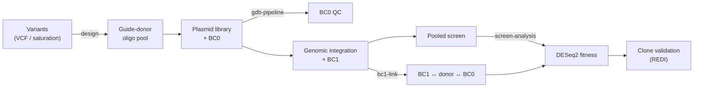

---
hide:
  - navigation
---

# MAGESTIC

  <strong>M</strong>ultiplexed <strong>A</strong>ccurate <strong>G</strong>enome <strong>E</strong>diting with <strong>S</strong>hort, <strong>T</strong>rackable, <strong>I</strong>ntegrated <strong>C</strong>ellular barcodes

  
  
  

---

MAGESTIC turns a list of genetic variants into a pooled, barcode-tracked CRISPR
editing experiment — and the analysis that reads it back out. Each variant is
built as a **guide + donor** oligo: the guide directs Cas9/Cas12a to the target
locus, the homology-arm donor templates the precise edit, and a short DNA
**barcode** is physically linked to that guide-donor so a cheap barcode readout
tells you which edit every cell in a pool carries.

`magestic` is one Python package spanning the full workflow:

## Start here

-   :material-download: **[Installation](installation.md)**

    Install the core package and the optional extras for design, screen
    analysis, and REDI.

-   :material-flask: **[Quick Start: Library Design](quickstart/design.md)**

    Go from a VCF (or a target ORF) to a synthesizable guide-donor oligo pool.

-   :material-chart-line: **[Quick Start: Screen Analysis](quickstart/screen.md)**

    Go from barcode reads to per-variant fitness with DESeq2 and tiered hit
    calling.

-   :material-sitemap: **[Architecture](ARCHITECTURE.md)**

    How the modules fit together, the two-barcode model, and the data flow.

## The two-barcode model

| Barcode | Lives in | Default length | Pipeline |
|---|---|---|---|
| **BC0** | plasmid library | 10 bp | [`guide_donor_bc0`](pipelines/guide_donor_bc0.md) |
| **BC1** | integrated genome | 20 bp | [`bc1_donor_bc0`](pipelines/bc1_donor_bc0.md) → [`bc1_from_screen`](pipelines/bc1_from_screen.md) |

BC0 confirms what's in the plasmid library and how evenly it's represented. BC1
is the screen-readable handle: `bc1_donor_bc0` links it back to the guide-donor
identity (via the shared BC0), and `bc1_from_screen` counts it across timepoints
to estimate each variant's fitness.

## Capabilities

| Area | Highlights |
|---|---|
| **Design** | PAM enumeration with 0/1-mismatch off-target analysis; off-target-aware guide selection; donor assembly with homology arms; SpCas9 / SpG / LbCas12a / impLbCas12a; VCF natural-variant and saturation-mutagenesis workflows |
| **Library QC** | Map plasmid reads to designed oligos; BC0 purity; library representation |
| **Barcode linking** | BC1 ↔ donor ↔ BC0 triplet linking; donor→oligo matching; multi-run integration |
| **Screen analysis** | BC1 error correction; abundance-tiered statistics; DESeq2 (median-of-ratios); multi-timepoint slope fitness; tier-aware hit calling; optional IHW |
| **Clone validation** | REDI colony purity; cross-array agreement; WGS edit correspondence |
| **In-silico VEP** | Evo2, ESM1v, Shorkie, Yorzoi model runners |
| **Visualization** | Gene tracks + VEP score panels at a locus |

## Citation

> Roy KR, Smith JD, Vonesch SC, *et al.* Multiplexed precision genome editing
> with trackable genomic barcodes in yeast. *Nature Biotechnology* 36, 512–520
> (2018). [doi:10.1038/nbt.4137](https://doi.org/10.1038/nbt.4137)

## License & contact

MIT licensed. Kevin R. Roy ·
[kevinrjroy@gmail.com](mailto:kevinrjroy@gmail.com) ·
[k-roy/MAGESTIC](https://github.com/k-roy/MAGESTIC)
